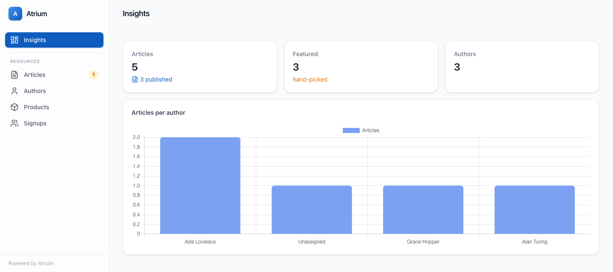

# Atrium

A PHP-configured, modular, open-source **admin panel framework for Symfony**.
Describe an admin interface entirely in PHP (resources, columns, fields,
actions) and get a polished, reactive UI with **no JavaScript build step and no
separate API**.
Reactivity is delivered server-side via Symfony UX Live Components; styling via
Tailwind.



> **Status: pre-1.0, under active development.** The reactive panel, tables,
> forms (fields, layout, tabs/wizards, validation, reactivity), actions, query
> scoping and the full resource lifecycle are implemented and tested. See the
> **[integration guide](docs/integration-guide/)** to build with it, the
> [`CHANGELOG`](CHANGELOG.md) for what's landed, and [`docs/PRDs/PRD.md`](docs/PRDs/PRD.md)
> for the roadmap.

## Documentation

The **[integration guide](docs/integration-guide/)** is the place to start —
[install and build your first resource](docs/integration-guide/getting-started.md),
then dive into [resources](docs/integration-guide/resources/overview.md),
[tables](docs/integration-guide/tables/table-configuration.md),
[forms](docs/integration-guide/forms/overview.md),
[actions](docs/integration-guide/actions/overview.md) and
[data](docs/integration-guide/data/providers.md).

## Requirements

- PHP >= 8.4
- Symfony 8.1

## Installation

```bash
composer require atriumphp/atrium
```

Register the bundle (Symfony Flex does this automatically; otherwise add it to
`config/bundles.php`):

```php
return [
    // ...
    Atrium\AtriumBundle::class => ['all' => true],
];
```

## Defining a resource

A resource is one PHP class per entity — point it at the entity, describe the
table and the form, and Atrium discovers it automatically (no tags, no YAML) and
serves a full CRUD screen:

```php
use Atrium\Form\Field\TextField;
use Atrium\Form\Schema;
use Atrium\Resource\AdminResource;
use Atrium\Table\Column;
use Atrium\Table\TableConfiguration;

final class TagResource extends AdminResource
{
    public function getEntityClass(): string
    {
        return Tag::class;
    }

    public function table(TableConfiguration $table): TableConfiguration
    {
        return $table->columns([
            Column::make('name')->sortable()->searchable(),
            Column::make('slug'),
        ]);
    }

    public function form(Schema $schema): Schema
    {
        return $schema->fields([
            TextField::make('name')->required(),
            TextField::make('slug')->required(),
        ]);
    }
}
```

That's a searchable, sortable, paginated list with Edit/New actions and a
validated create/edit form, at `/admin/tag`. Non-trivial resources delegate to
dedicated `Tables/`, `Schemas/` and `Pages/` classes; small ones inline as above.
See the [getting-started guide](docs/integration-guide/getting-started.md) for the
full walkthrough.

## Quality gates

```bash
composer test       # PHPUnit
composer phpstan    # PHPStan (max)
composer cs         # PHP-CS-Fixer (Symfony ruleset), dry-run check
composer cs:fix     # PHP-CS-Fixer, apply
```

## License

[MIT](LICENSE).
